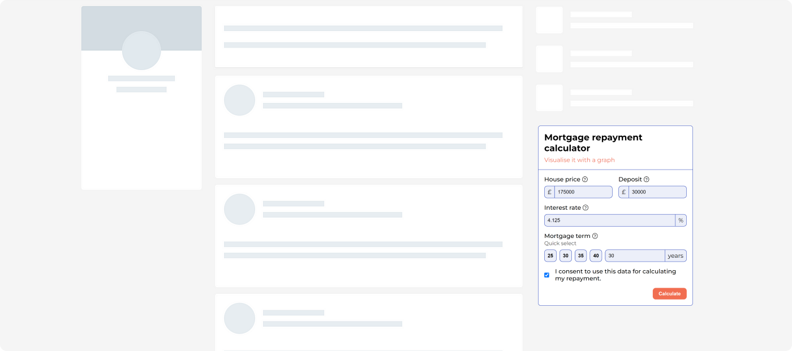

# Mortgage repayment calculator

This is a web component widget for developers to embed on their
websites if they want to provide users with a new feature to
calculate mortgage repayments.



## Getting started

This component has one dependency, which is a `45 KB` library
called [Lightweight Charts](https://www.tradingview.com/lightweight-charts/).

Before using the web component, please ensure you load
the [Lightweight Charts](https://www.tradingview.com/lightweight-charts/) dependency
either through a [CDN](https://tradingview.github.io/lightweight-charts/tutorials/customization/creating-a-chart) or
as an [NPM dependency](https://www.npmjs.com/package/lightweight-charts).

### Examples (buildless)

#### As a script

```html
<head>
  <!-- dependency -->
  <script defer src="https://unpkg.com/lightweight-charts/dist/lightweight-charts.standalone.production.js"></script>
  <!-- component -->
  <script defer src="../index.js" type="module"></script>
</head>
<body>
  <mortgage-repayment-calculator></mortgage-repayment-calculator>
</body>
</html>
```

#### As an import within your js module

```html
<head>
  <!-- dependency -->
  <script defer src="https://unpkg.com/lightweight-charts/dist/lightweight-charts.standalone.production.js"></script>
  <!-- your own script module -->
  <script defer src="someModule.js" type="module"></script>
</head>
<body>
  <mortgage-repayment-calculator></mortgage-repayment-calculator>
</body>
</html>
```

```js
// someModule.js
import "../dist/index.js";
```

For full examples, see [the demo folder](/demo/).

#### NPM

```html
<head>
  <!-- dependency -->
  <script defer src="https://unpkg.com/lightweight-charts/dist/lightweight-charts.standalone.production.js"></script>
  <!-- component -->
  <script defer type="module" src="./node_modules/mortgage-repayment-calculator/index.js"></script>
</head>
<body>
  <mortgage-repayment-calculator></mortgage-repayment-calculator>
</body>
</html>
```

```js
// someModule.js
import "../dist/index.js";
```

### Examples (frameworks, build involved)
This applies if you're using ReactJs, NextJS, etc.

It will widely depend on the framework you use and how it operates
but the process should be similar.

Here is a NextJS example:

```js
// the web component was only built to run client-sided
"use client";

import "mortgage-repayment-calculator";

function MyComponent() {
  return (
    <>
      // dependency - must be a script, cannot be npm
      <Script src="https://unpkg.com/lightweight-charts/dist/lightweight-charts.standalone.production.js"/>
      // component
      <mortgage-repayment-calculator/>
    </>
  )
}

export default MyComponent;
```

### Configuration & Styling
You can customise the component to align better with your website style.

See [config.js](/dist/config.js) file to edit colors, radius, and fonts.

## Why is this a web component?

Web components are widely available in the top browsers _(i.e. Chrome, Edge, Firefore, and Safari)_. They allow for code encapsulation and they are not tied to a framework like React or Angular. This means the component will not affect your website and your website will not affect the component. Lastly, you will be able to use this component irrelevant of how your website is built _(i.e. framework or not)_.

You can read more about web components here: https://developer.mozilla.org/en-US/docs/Web/API/Web_components
